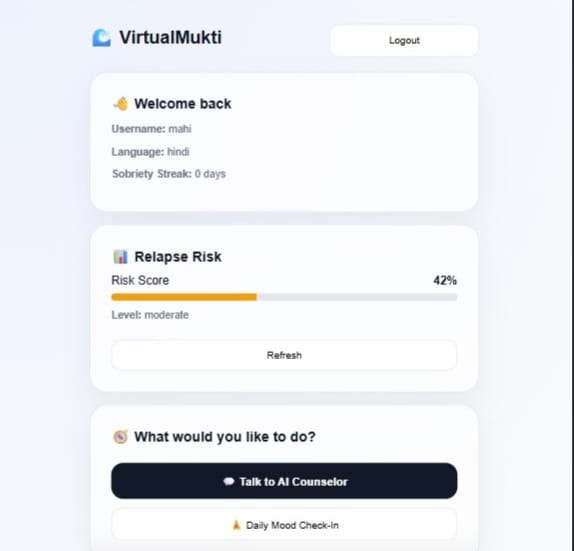
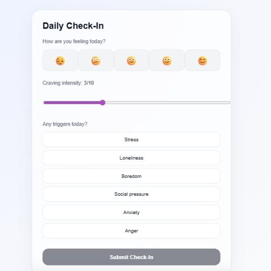

# VirtualMukti

**AI-Powered Addiction Recovery Platform for Indian Users**

VirtualMukti is a privacy-first addiction recovery platform designed for individuals in India (ages 18-45) struggling with alcohol, cannabis, and opioid addiction. The platform provides anonymous onboarding, AI-based relapse prediction, Hindi/Hinglish CBT chatbot support, daily recovery tracking, emergency SOS features, and rehabilitation center lookup.

## Features

- 🔒 **Anonymous Onboarding** - No phone number or Aadhaar required
- 🤖 **AI Relapse Prediction** - LSTM-based risk assessment with explainable outputs
- 💬 **Hindi/Hinglish CBT Chatbot** - Powered by Gemini 3 Flash
- 📊 **Daily Recovery Flows** - Personalized exercises and progress tracking
- 🆘 **SOS Emergency Support** - Immediate crisis resources and coping strategies
- 🏥 **NMK Lookup** - Find nearby Nasha Mukti Kendras (rehabilitation centers)
- 🌐 **Low Bandwidth Support** - Optimized for rural connectivity
- 🔐 **Privacy-First** - AES-256 encryption, NDHM-style privacy compliance

## Tech Stack

### Backend
- **Framework**: FastAPI (Python)
- **Database**: MongoDB with Motor (async driver)
- **AI/ML**: TensorFlow/Keras (LSTM), Gemini 3 Flash (chatbot)
- **Realtime**: Firebase Realtime Database
- **APIs**: Google Maps API for NMK lookup
- **Security**: AES-256 encryption, JWT authentication

### Frontend
- **Framework**: React 18 with TypeScript
- **Build Tool**: Vite
- **Routing**: React Router
- **State Management**: React Context (to be added)
- **PWA**: Vite PWA plugin for offline support
- **Testing**: Vitest, fast-check (property-based testing)

## Project Structure

```
VirtualMukti/
├── backend/
│   ├── api/              # API route handlers
│   ├── ml/               # ML models and services
│   ├── chatbot/          # Chatbot service
│   ├── config.py         # Configuration management
│   ├── database.py       # MongoDB connection
│   ├── encryption.py     # AES-256 encryption utilities
│   ├── firebase_init.py  # Firebase initialization
│   ├── main.py           # FastAPI application
│   └── requirements.txt  # Python dependencies
├── frontend/
│   ├── src/
│   │   ├── components/   # React components
│   │   ├── pages/        # Page components
│   │   ├── styles/       # CSS styles
│   │   ├── config/       # Configuration files
│   │   ├── App.tsx       # Main app component
│   │   └── main.tsx      # Entry point
│   ├── package.json      # Node dependencies
│   └── vite.config.ts    # Vite configuration
├── docs/                 # Documentation
└── .kiro/specs/          # Feature specifications
```

## Getting Started

### Prerequisites

- Python 3.10+
- Node.js 18+
- MongoDB 6.0+
- Firebase account
- Gemini API key
- Google Maps API key

### Backend Setup

1. Navigate to backend directory:
```bash
cd backend
```

2. Create virtual environment:
```bash
python -m venv venv
source venv/bin/activate  # On Windows: venv\Scripts\activate
```

3. Install dependencies:
```bash
pip install -r requirements.txt
```

4. Create `.env` file from example:
```bash
cp .env.example .env
```

5. Configure environment variables in `.env`:
   - MongoDB URI
   - JWT secret key
   - Firebase credentials
   - Gemini API key
   - Google Maps API key
   - Encryption keys

6. Run the backend:
```bash
python -m backend.main
```

Backend will be available at `http://localhost:8000`

### Frontend Setup

1. Navigate to frontend directory:
```bash
cd frontend
```

2. Install dependencies:
```bash
npm install
```

3. Create `.env` file from example:
```bash
cp .env.example .env
```

4. Configure environment variables in `.env`:
   - API base URL
   - Firebase configuration
   - Google Maps API key

5. Run the development server:
```bash
npm run dev
```

Frontend will be available at `http://localhost:3000`

## Development

### Running Tests

**Backend:**
```bash
cd backend
pytest
```

**Frontend:**
```bash
cd frontend
npm test
```

### Code Quality

**Backend:**
```bash
# Format code
black backend/

# Type checking
mypy backend/
```

**Frontend:**
```bash
# Lint
npm run lint

# Type checking
npm run type-check
```

## API Documentation

Once the backend is running, visit:
- Swagger UI: `http://localhost:8000/docs`
- ReDoc: `http://localhost:8000/redoc`

## Security

- All user data encrypted at rest (AES-256)
- Data in transit encrypted (TLS 1.3)
- No PII collection (no phone/Aadhaar)
- JWT-based authentication with httpOnly cookies
- CORS protection
- Rate limiting on all endpoints

## Privacy Compliance

VirtualMukti follows NDHM-style privacy guidelines:
- Anonymous user sessions
- Encrypted data storage
- No third-party data sharing
- User data deletion on request
- PII anonymization in conversations

## Contributing

This is an MVP prototype. For feature requests or bug reports, please refer to the spec files in `.kiro/specs/virtualmukti/`.

## License

Proprietary - All rights reserved

## Support

For support and questions, please refer to the documentation in the `docs/` directory.

---

**Note**: This is an MVP prototype. Ensure all API keys and credentials are properly secured before deployment.
"# VirtualMukti-ai-for-Bharat" 

## 🖼 Screenshots


### 📊 Dashboard


### 💬 AI Counselor


### 🧘 Mood Check-In

<<<<<<< HEAD
=======

>>>>>>> 318579567006ff0979fbbdff5a1cee018e687980
